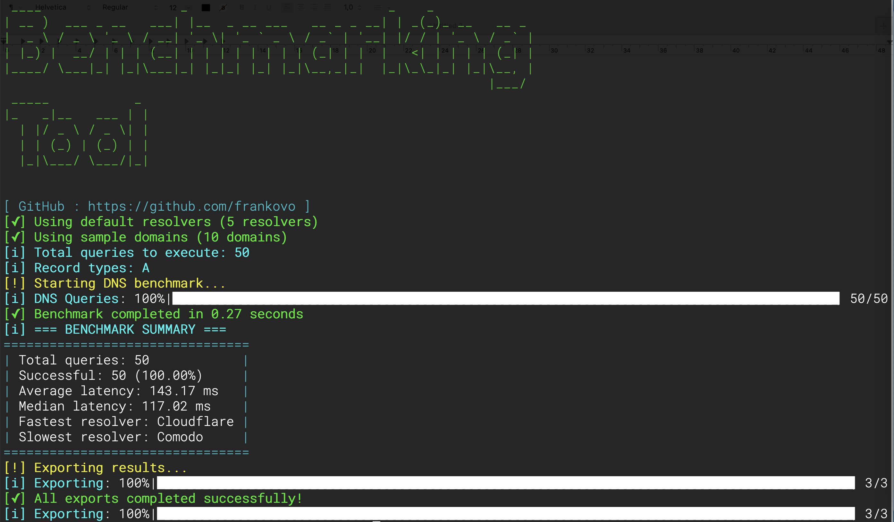
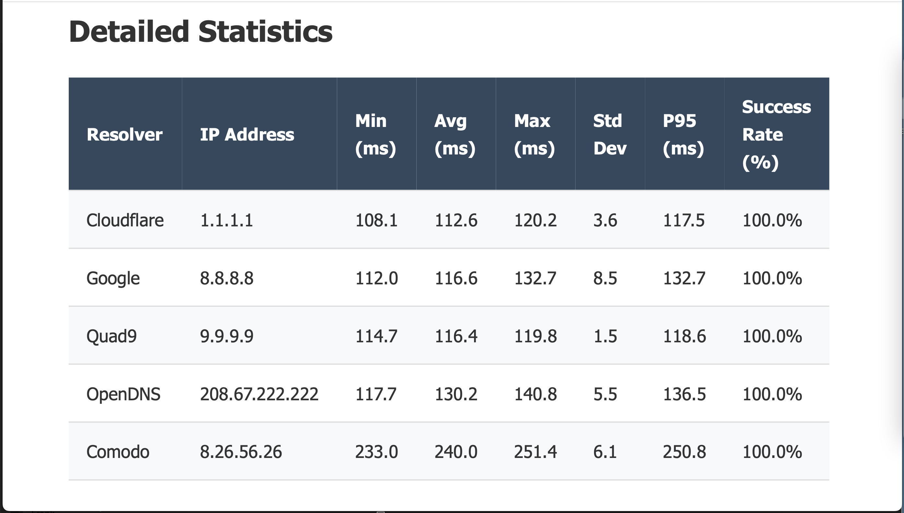
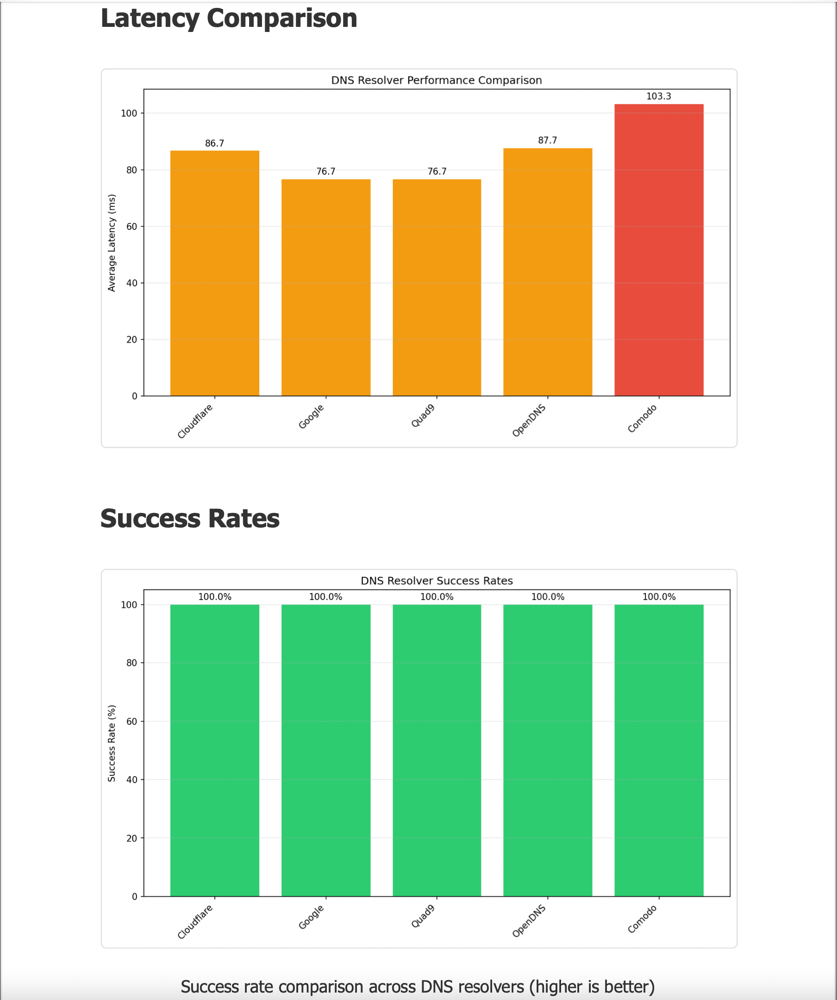

# net-benchmark

快速、可扩展的网络性能基准测试 — DNS、HTTP、SSL，一个命令行工具全搞定。

[](https://pypi.org/project/net-benchmark)
[](https://pypi.org/project/net-benchmark)
[](LICENSE)
[](https://github.com/net-benchmark/net-benchmark/actions)
[](https://pepy.tech/project/net-benchmark)
[](https://net-benchmark.readthedocs.io/en/latest/)
[](https://github.com/net-benchmark/net-benchmark/discussions)
[](https://pypi.org/project/net-benchmark)
[](https://github.com/net-benchmark/net-benchmark/stargazers)

```bash
pip install net-benchmark
pip install net-benchmark[pdf]   # 如需导出 PDF
```

> **原项目 `dns-benchmark-tool` 的继承者** — 完全向下兼容。  
> `dns-benchmark` 命令依然可用。

---

## 目录

- [安装](#安装)
- [工具](#工具)
  - [DNS 基准测试](#dns-基准测试)
  - [HTTP 基准测试](#http-基准测试)
  - [SSL 检查](#ssl-检查)
- [导出格式](#导出格式)
- [发布流程](#发布流程)
- [链接与支持](#链接与支持)
- [贡献](#贡献)
- [许可证](#许可证)

---

## 安装

```bash
pip install net-benchmark          # 核心功能
pip install net-benchmark[pdf]     # 包含 PDF 导出
```

### 环境要求

- Python 3.9+
- pip 包管理器

### 从源码安装

```bash
git clone https://github.com/net-benchmark/net-benchmark.git
cd net-benchmark
pip install -e .
```

### 验证安装

```bash
net-benchmark --version
net-benchmark dns --help
net-benchmark http --help

# 查看某个命令的所有选项
net-benchmark dns benchmark --help
net-benchmark http benchmark --help
```

### 第一次运行

```bash
# 使用默认配置快速体验（推荐）
net-benchmark dns benchmark --use-defaults --formats csv,excel

# HTTP 基准测试快速体验
net-benchmark http benchmark --use-defaults --formats csv,excel
```

---

## 工具

### DNS 基准测试

<details>
<summary><strong>DNS 基准测试</strong> — 测试 DNS 解析器性能、DNSSEC、DoH/DoT</summary>

#### 🎯 为什么需要这个工具？

DNS 解析往往是网络性能的隐形瓶颈。一个慢的解析器可能让每个请求都增加数百毫秒的延迟。

##### 问题

- ⏱️ **隐形瓶颈**：DNS 可能让每次请求增加 300ms 以上
- 🤷 **性能未知**：大多数开发者从未测试过自己的 DNS
- 🌍 **地理位置敏感**：“最快”的解析器取决于你所在的位置
- 🔒 **安全性参差不齐**：DNSSEC、DoH、DoT 的支持程度大相径庭

##### 解决方案

net-benchmark 可以帮你：

- 🔍 **找到最快的** DNS 解析器（针对你的网络环境）
- 📊 **获取真实数据** — P95、P99、抖动、稳定性评分
- 🛡️ **验证安全性** — 内置 DNSSEC 验证
- 🚀 **大规模测试** — 数秒内完成 100+ 并发查询

##### 谁适合用？

- ✅ **开发者** — 优化 API 性能
- ✅ **DevOps/SRE** — 验证解析器 SLA
- ✅ **自建 DNS 用户** — 对比 Pi-hole/Unbound 与公共 DNS
- ✅ **网络管理员** — 执行合规性检查

---

#### 快速开始

```bash
# 使用默认解析器和域名进行测试
net-benchmark dns benchmark --use-defaults --formats csv,excel
```

结果会自动保存到 `./benchmark_results/`，包含汇总 CSV、详细原始数据，以及可选的 PDF/Excel 报告。

> 安装详情见 [安装](#安装)。  
> PDF 导出依赖见 [导出格式](#导出格式) 中的 [PDF 依赖](#pdf-dependencies)。

---

#### ⚡ 命令一览

| 命令 | 功能 | 快速示例 |
|---|---|---|
| `benchmark` | 完整 DNS 基准测试并导出 | `net-benchmark dns benchmark --use-defaults` |
| `top` | 按速度对解析器排名 | `net-benchmark dns top --limit 5` |
| `compare` | 解析器对比 | `net-benchmark dns compare Cloudflare Google Quad9` |
| `monitoring` | 持续监控并告警 | `net-benchmark dns monitoring --use-defaults` |

```bash
# 立刻找出你当前最快的解析器
net-benchmark dns top --limit 5

# 对比三大公共 DNS
net-benchmark dns compare Cloudflare Google Quad9 --show-details

# 使用 DoT 监控 1 小时并设置延迟告警
net-benchmark dns monitoring --use-defaults --dot \
  --interval 30 --duration 3600 \
  --alert-latency 150 --output monitor.log
```

---

#### ✨ 核心特性

##### 🚀 性能

- **异步查询** — 可同时测试 100+ 个解析器
- **多次迭代** — 多次运行以获取更准确的结果
- **统计分析** — 均值、中位数、P95、P99、抖动、稳定性
- **缓存控制** — 可选择是否利用 DNS 缓存

##### 🔒 安全与隐私

- **DNSSEC 验证** — 验证加密信任链
- **DNS-over-HTTPS (DoH)** — 加密 DNS 基准测试
- **DNS-over-TLS (DoT)** — 安全传输层测试
- **DNS-over-QUIC (DoQ)** — 实验性 QUIC 支持

##### 📊 分析与导出

- **多种格式** — CSV、Excel、PDF、JSON（详见 [导出格式](#导出格式)）
- **可视化报告** — 图表和图形
- **域名统计** — 按域名分析性能
- **错误分类** — 识别有问题的解析器

##### 🏢 企业特性

- **TSIG 认证** — 企业级安全查询
- **区域传输** — AXFR/IXFR 验证
- **动态更新** — 测试 DNS 写操作
- **合规报告** — 审计就绪的文档

##### 🌐 跨平台

- **Linux、macOS、Windows** — 全平台支持
- **CI/CD 友好** — JSON 输出、退出码
- **IDNA 支持** — 国际化域名
- **自动检测** — Windows WMI DNS 发现

---

#### 🔒 安全与加密 DNS

支持三种协议，各自有隐私增益，但会增加一定延迟。

| 协议 | 参数 | 典型额外延迟 | 适用场景 |
|---|---|---|---|
| 普通 UDP | *(默认)* | 基准值 | 延迟基准测试 |
| DNS-over-HTTPS | `--doh` | +50–200ms | 隐私、绕过防火墙 |
| DNS-over-TLS | `--dot` | +200–500ms (初次), ~50ms (复用) | 加密传输 |
| DNSSEC | `--dnssec-validate` | +30–100ms | 验证解析器完整性 |

> ⚠️ **权衡说明**
> - DoH 和 DoT 在第一次查询每个解析器时会增加 TLS 握手开销。使用 `--warmup-fast` 可在测量前消除这部分影响。
> - `--dnssec-validate` 会请求 RRSIG 记录并强制要求 AD 标志。只有约 33% 的常用域名签名了 DNSSEC —— 未签名的域名会返回 `DNSSEC_FAILED` 结果。开启与关闭此选项的延迟数据**不能直接对比**。
> - 手机热点或移动网络结果的方差可能是有线网络的 2–5 倍。建议使用 `--iterations 5` 并比较中位数延迟而非平均值。

```bash
# DoH 基准测试
net-benchmark dns benchmark \
  --resolvers "Cloudflare,Google" \
  --domains "cloudflare.com,google.com" \
  --doh --warmup-fast

# 自定义 DoH URL（需与解析器一一对应，数量不匹配会提前报错）
net-benchmark dns benchmark \
  --resolvers "Cloudflare,Google" \
  --domains "bing.com,google.com" \
  --doh \
  --doh-url "https://cloudflare-dns.com/dns-query,https://dns.google/dns-query" \
  --iterations 1 \
  --formats csv \
  --output ./doh_results_explicit_urls

# DoT + DNSSEC（仅签名域名）
net-benchmark dns benchmark \
  --resolvers "Cloudflare,Quad9" \
  --domains "cloudflare.com,quad9.net" \
  --dot \
  --dnssec-validate

# DoH 排名
net-benchmark dns top --doh --limit 5

# DoT 可靠性排名
net-benchmark dns top --dot --metric reliability --limit 5

# 对比 DoH 解析器
net-benchmark dns compare Cloudflare Google --doh --iterations 3

# DoT 监控
net-benchmark dns monitoring --use-defaults --dot \
  --interval 60 --alert-latency 300

# DoH + DNSSEC 并导出
net-benchmark dns benchmark --use-defaults --doh --dnssec-validate --formats csv,excel

# DoT + DNSSEC + 多次迭代
net-benchmark dns benchmark \
  --resolvers "Cloudflare,Quad9,Google" \
  --domains "cloudflare.com,quad9.net,google.com" \
  --dot \
  --dnssec-validate \
  --iterations 5 \
  --formats excel

# DoH + 自定义 URL + 监控
net-benchmark dns monitoring \
  --resolvers "Cloudflare,Google" \
  --doh \
  --doh-url "https://cloudflare-dns.com/dns-query,https://dns.google/dns-query" \
  --interval 30 --duration 7200
```

**提前失败的例子** — 这些命令会在运行任何查询前立即报错：

```bash
# --doh 和 --dot 互斥
net-benchmark dns benchmark --use-defaults --doh --dot
# ERROR: --doh and --dot are mutually exclusive.

# --doh-url 数量必须与 --resolvers 数量一致
net-benchmark dns benchmark --resolvers "Cloudflare,Google" --doh \
  --doh-url "https://cloudflare-dns.com/dns-query"
# ERROR: --doh-url has 1 URL(s) but --resolvers has 2 resolver(s). Counts must match.

# 自定义 IP 使用 --doh 时必须提供 --doh-url
net-benchmark dns benchmark --resolvers "192.168.1.1" --doh
# ERROR: --doh requires a DoH URL for: 192.168.1.1. Use --doh-url to supply them explicitly.
```

---

#### 🔧 高级功能

> ⚠️ 以下参数已**在文档中标出**，但尚未实现。它们是未来的高级特性。

- `--zone-transfer` → AXFR/IXFR 区域传输测试 *(即将推出)*
- `--tsig` → TSIG 认证查询 *(即将推出)*
- `--idna` → 国际化域名支持 *(即将推出)*

<details>
<summary><b>🚀 性能与并发特性</b></summary>

<br>

- **基于 dnspython 的异步 I/O** — 可同时测试 100+ 个解析器
- **Trio 框架支持** — 高并发异步操作
- **可配置并发数** — 控制最大并发查询数
- **重试逻辑** — 失败查询的指数退避重试
- **缓存模拟** — 可选择是否利用 DNS 缓存
- **多次迭代基准测试** — 多次运行提高准确性
- **预热阶段** — 在测试前预热 DNS 缓存
- **统计分析** — 均值、中位数、P95、P99、抖动、稳定性评分

**示例：**

```bash
net-benchmark dns benchmark \
  --max-concurrent 200 \
  --iterations 5 \
  --timeout 3.0 \
  --warmup
```

</details>

<details>
<summary><b>🔒 安全与隐私特性</b></summary>

<br>

- **DNSSEC 验证** — 验证加密信任链
- **DNS-over-HTTPS (DoH)** — 基于 HTTPS 的加密 DNS 基准测试
- **DNS-over-TLS (DoT)** — 安全传输层测试
- **DNS-over-QUIC (DoQ)** — 实验性 QUIC 协议支持
- **TSIG 认证** — 企业级 DNS 事务签名
- **EDNS0 支持** — 扩展 DNS 功能和更大负载

**示例：**

```bash
# 测试 DoH 解析器
net-benchmark dns benchmark \
  --doh \
  --resolvers doh-providers.json \
  --dnssec-validate
```

</details>

<details>
<summary><b>🏢 企业及迁移特性</b></summary>

<br>

- **区域传输 (AXFR/IXFR)** — 完整和增量区域传输验证
- **动态 DNS 更新** — 测试 DNS 写操作
- **EDNS0 支持** — 扩展 DNS 选项、客户端子网、更大负载
- **Windows WMI 集成** — 自动检测系统当前 DNS 设置
- **合规报告** — 生成审计就绪的 PDF/Excel 报告
- **SLA 验证** — 跟踪正常运行时间和性能阈值

**示例：**

```bash
# 验证 DNS 迁移
net-benchmark dns benchmark \
  --resolvers old-provider.json,new-provider.json \
  --zone-transfer \ # 即将推出
  --output migration-report/ \
  --formats pdf,excel
```

</details>

<details>
<summary><b>📊 分析与报告特性</b></summary>

<br>

- **按域名统计** — 分析每个域名的性能
- **按记录类型统计** — 比较 A、AAAA、MX、TXT 等
- **错误分类** — 统计错误类型
- **对比矩阵** — 解析器并排对比
- **趋势分析** — 多次运行下的性能变化
- **按条件找最佳** — 按延迟/可靠性/稳定性找出最佳解析器

**示例：**

```bash
# 详细分析
net-benchmark dns benchmark \
  --use-defaults \
  --formats csv,excel \
  --domain-stats \
  --record-type-stats \
  --error-breakdown \
  --formats csv,excel,pdf
```

</details>

<details>
<summary><b>🌐 国际化与兼容性</b></summary>

<br>

- **IDNA 支持** — 国际化域名 (IDN)
- **多种记录类型** — A, AAAA, MX, TXT, CNAME, NS, SOA, PTR, SRV, CAA
- **跨平台** — Linux, macOS, Windows（原生支持）
- **CI/CD 集成** — JSON 输出、正确的退出码、静默模式
- **自定义解析器** — 从 JSON 加载，测试自己的 DNS 服务器
- **自定义域名** — 针对特定域名列表进行测试

**示例：**

```bash
# 测试国际化域名
net-benchmark dns benchmark \
  --domains international-domains.txt \
  --record-types A,AAAA,MX \
  --resolvers custom-resolvers.json
```

</details>

> 💡 **大多数用户只需要基础功能。** 这些高级特性在你需要时随手可用。

---

#### 💼 使用场景

##### 🔧 开发者：优化 API 性能

```bash
# 找到 API 端点最快的 DNS
net-benchmark dns benchmark \
  --domains api.myapp.com,cdn.myapp.com \
  --record-types A,AAAA \
  --resolvers production.json \
  --iterations 10
```

**结果：** API 延迟降低 100-300ms

---

##### 🛡️ DevOps/SRE：迁移前验证

```bash
# 在切换 DNS 服务商前测试新旧解析器
net-benchmark dns benchmark \
  --resolvers current-dns.json,new-dns.json \
  --use-defaults \
  --dnssec-validate \
  --output migration-report/ \
  --formats csv,excel
```

**结果：** 迁移前验证性能和安全

---

##### 🏠 自建 DNS 用户：证明 Pi-hole 性能

```bash
# 对比 Pi-hole 与公共 DNS
net-benchmark dns compare \
  --resolvers pihole.local,1.1.1.1,8.8.8.8,9.9.9.9 \
  --domains common-sites.txt \
  --rounds 10
```

**结果：** 用数据证明自建 DNS 是否真的更快

---

##### 📊 网络管理员：自动化健康检查

```bash
# 加入 crontab 每月生成报告
0 0 1 * * net-benchmark dns benchmark \
  --use-defaults \
  --output /var/reports/dns/ \
  --formats excel,csv \
  --domain-stats \
  --error-breakdown
```

**结果：** 自动化的合规和 SLA 报告

---

##### 🔐 隐私倡导者：测试加密 DNS

```bash
# 基准测试注重隐私的 DoH/DoT 解析器
net-benchmark dns benchmark \
  --doh \
  --resolvers privacy-resolvers.json \
  --domains sensitive-sites.txt \
  --dnssec-validate
```

**结果：** 找到最快的加密 DNS，同时不牺牲隐私

---

#### 📖 使用示例

##### 基本用法

```bash
# 带进度条的基本测试
net-benchmark dns benchmark --use-defaults --formats csv,excel

# 静默模式（无进度条）
net-benchmark dns benchmark --use-defaults --formats csv,excel --quiet

# 自定义解析器和域名
net-benchmark dns benchmark --resolvers data/resolvers.json --domains data/domains.txt

# 仅 CSV 的快速测试
net-benchmark dns benchmark --use-defaults --formats csv
```

##### 高级用法

```bash
# 导出机器可读的 JSON 包
net-benchmark dns benchmark --use-defaults --json --output ./results

# 测试特定记录类型
net-benchmark dns benchmark --use-defaults --formats csv,excel --record-types A,AAAA,MX

# 自定义输出位置和格式
net-benchmark dns benchmark \
  --use-defaults \
  --output ./my-results \
  --formats csv,excel

# 包含详细统计
net-benchmark dns benchmark \
  --use-defaults \
  --formats csv,excel \
  --record-type-stats \
  --error-breakdown

# 高并发+重试
net-benchmark dns benchmark \
  --use-defaults \
  --formats csv,excel \
  --max-concurrent 200 \
  --timeout 3.0 \
  --retries 3

# 网站迁移计划
net-benchmark dns benchmark \
  --resolvers data/global_resolvers.json \
  --domains data/migration_domains.txt \
  --formats excel,pdf \
  --output ./migration_analysis

# DNS 服务商选型
net-benchmark dns benchmark \
  --resolvers data/provider_candidates.json \
  --domains data/business_domains.txt \
  --formats csv,excel \
  --output ./provider_selection

# 网络排错
net-benchmark dns benchmark \
  --resolvers "192.168.1.1,1.1.1.1,8.8.8.8" \
  --domains "problematic-domain.com,working-domain.com" \
  --timeout 10 \
  --retries 3 \
  --formats csv \
  --output ./troubleshooting

# 安全评估
net-benchmark dns benchmark \
  --resolvers data/security_resolvers.json \
  --domains data/security_test_domains.txt \
  --formats pdf \
  --output ./security_assessment

# 性能监控
net-benchmark dns benchmark \
  --use-defaults \
  --formats csv \
  --quiet \
  --output /var/log/net_benchmark/$(date +%Y%m%d_%H%M%S)
```

#### 解析器和域名的内联输入支持

该功能完整支持用逗号分隔的内联值来指定 `--resolvers` 和 `--domains`。

##### 新能力

1. **内联解析器**: `--resolvers "1.1.1.1,8.8.8.8,9.9.9.9"`
2. **内联域名**: `--domains "google.com,github.com"`
3. **单个值**: `--resolvers "1.1.1.1"` 或 `--domains "google.com"`
4. **命名解析器**: `--resolvers "cloudflare,google,quad9"`
5. **混合输入**: `--resolvers "1.1.1.1,cloudflare,8.8.8.8"`

##### 向下兼容

- 所有基于文件的配置依然可用
- CLI 无破坏性变更
- 文件检测优先于内联解析

##### 使用示例

###### 之前（只有文件可以工作）

```bash
net-benchmark dns benchmark \
    --resolvers data/resolvers.json \
    --domains data/domains.txt
```

###### 之后（两者都可以）

```bash
# 内联（新方式）
net-benchmark dns benchmark \
    --resolvers "1.1.1.1,8.8.8.8,9.9.9.9" \
    --domains "google.com,github.com" \
    --timeout 10 \
    --retries 3 \
    --formats csv \
    --output ./troubleshooting

# 文件（依然有效）
net-benchmark dns benchmark \
    --resolvers data/resolvers.json \
    --domains data/domains.txt \
    --formats csv
```

###### 命名解析器

```bash
net-benchmark dns benchmark \
    --resolvers "Cloudflare,Google,Quad9" \
    --domains "google.com,github.com" \
    --timeout 10 \
    --retries 3 \
    --formats csv \
    --output ./troubleshooting_named
```

###### 混合输入

```bash
net-benchmark dns benchmark \
    --resolvers "1.1.1.1,Cloudflare,8.8.8.8" \
    --domains "google.com,github.com" \
    --timeout 10 \
    --retries 3 \
    --formats csv \
    --output ./troubleshooting_mixed
```

###### 单个

```bash
net-benchmark dns benchmark \
    --resolvers "1.1.1.1" \
    --domains "google.com" \
    --timeout 10 \
    --retries 3 \
    --formats csv \
    --output ./troubleshooting
```

#### 🔧 实用工具

##### 解析器管理

```bash
# 显示默认解析器和域名
net-benchmark dns list-defaults

# 浏览所有可用解析器
net-benchmark dns list-resolvers

# 详细信息
net-benchmark dns list-resolvers --details

# 按类别筛选
net-benchmark dns list-resolvers --category security
net-benchmark dns list-resolvers --category privacy
net-benchmark dns list-resolvers --category family

# 导出为不同格式
net-benchmark dns list-resolvers --format csv
net-benchmark dns list-resolvers --format json
```

##### 域名管理

```bash
# 列出所有测试域名
net-benchmark dns list-domains

# 按类别查看
net-benchmark dns list-domains --category tech
net-benchmark dns list-domains --category ecommerce
net-benchmark dns list-domains --category social

# 限制结果数量
net-benchmark dns list-domains --count 10
net-benchmark dns list-domains --category news --count 5

# 导出域名列表
net-benchmark dns list-domains --format csv
net-benchmark dns list-domains --format json
```

##### 类别概览

```bash
# 查看所有可用类别
net-benchmark dns list-categories
```

##### 配置管理

```bash
# 生成示例配置
net-benchmark dns generate-config --output sample_config.yaml

# 按类别生成特定配置
net-benchmark dns generate-config --category security --output security_test.yaml
net-benchmark dns generate-config --category family --output family_protection.yaml
net-benchmark dns generate-config --category performance --output performance_test.yaml

# 为特定场景生成自定义配置
net-benchmark dns generate-config --category privacy --output privacy_audit.yaml
```

---

#### 完整使用指南

##### 快速性能测试

```bash
# 带进度条的基本测试
net-benchmark dns benchmark --use-defaults

# 静默模式仅 CSV
net-benchmark dns benchmark --use-defaults --formats csv --quiet

# 指定记录类型
net-benchmark dns benchmark --use-defaults --record-types A,AAAA,MX
```

附加分析参数：

```bash
# 包含域名、记录类型统计和错误分类
net-benchmark dns benchmark --use-defaults \
  --domain-stats --record-type-stats --error-breakdown
```

JSON 导出：

```bash
# 导出机器可读数据包
net-benchmark dns benchmark --use-defaults --json --output ./results
```

##### 网络管理员

```bash
# 对比内部与外部 DNS
net-benchmark dns benchmark \
  --resolvers "192.168.1.1,1.1.1.1,8.8.8.8,9.9.9.9" \
  --domains "internal.company.com,google.com,github.com,api.service.com" \
  --formats excel,pdf \
  --timeout 3 \
  --max-concurrent 50 \
  --output ./network_audit

# 测试 DNS 故障转移场景
net-benchmark dns benchmark \
  --resolvers data/primary_resolvers.json \
  --domains data/business_critical_domains.txt \
  --record-types A,AAAA \
  --retries 3 \
  --formats csv,excel \
  --output ./failover_test
```

##### ISP 与网络运营商

```bash
# ISP 解析器综合对比
net-benchmark dns benchmark \
  --resolvers data/isp_resolvers.json \
  --domains data/popular_domains.txt \
  --timeout 5 \
  --max-concurrent 100 \
  --formats csv,excel,pdf \
  --output ./isp_performance_analysis

# 区域性能测试
net-benchmark dns benchmark \
  --resolvers data/regional_resolvers.json \
  --domains data/regional_domains.txt \
  --formats excel \
  --quiet \
  --output ./regional_analysis
```

##### 开发者与 DevOps

```bash
# 测试应用依赖
net-benchmark dns benchmark \
  --resolvers "1.1.1.1,8.8.8.8" \
  --domains "api.github.com,registry.npmjs.org,pypi.org,docker.io,aws.amazon.com" \
  --formats csv \
  --quiet \
  --output ./app_dependencies

# CI/CD 集成测试
net-benchmark dns benchmark \
  --resolvers data/ci_resolvers.json \
  --domains data/ci_domains.txt \
  --timeout 2 \
  --formats csv \
  --quiet
```

##### 安全审计员

```bash
# 安全导向的解析器测试
net-benchmark dns benchmark \
  --resolvers data/security_resolvers.json \
  --domains data/malware_test_domains.txt \
  --formats csv,pdf \
  --output ./security_audit

# 隐私导向测试
net-benchmark dns benchmark \
  --resolvers data/privacy_resolvers.json \
  --domains data/tracking_domains.txt \
  --formats excel \
  --output ./privacy_analysis
```

##### 企业 IT

```bash
# 企业网络评估
net-benchmark dns benchmark \
  --resolvers data/enterprise_resolvers.json \
  --domains data/corporate_domains.txt \
  --record-types A,AAAA,MX,TXT,SRV \
  --timeout 10 \
  --max-concurrent 25 \
  --retries 2 \
  --formats csv,excel,pdf \
  --output ./enterprise_dns_audit

# 多地域测试
net-benchmark dns benchmark \
  --resolvers data/global_resolvers.json \
  --domains data/international_domains.txt \
  --formats excel \
  --output ./global_performance
```

#### 🔍 新的 CLI 选项

| 选项 | 描述 | 示例 |
|---|---|---|
| `--iterations, -i` | 完整基准测试循环运行 **N 次** | `net-benchmark dns benchmark --use-defaults -i 3` |
| `--use-cache` | 允许跨迭代重用缓存结果 | `net-benchmark dns benchmark --use-defaults -i 3 --use-cache` |
| `--warmup` | 运行**完整预热**（所有解析器 × 域名 × 记录类型） | `net-benchmark dns benchmark --use-defaults --warmup` |
| `--warmup-fast` | 运行**轻量级预热**（每个解析器一次探测） | `net-benchmark dns benchmark --use-defaults --warmup-fast` |
| `--include-charts` | 在 PDF/Excel 报告中嵌入图表 | `net-benchmark dns benchmark --use-defaults --formats pdf,excel --include-charts` |

---

#### ⚡ CLI 命令详解

##### 🚀 Top

快速按速度和可靠性对解析器排名。

```bash
# 快速排名
net-benchmark dns top

# 使用自定义域名列表
net-benchmark dns top -d domains.txt

# 导出结果为 JSON
net-benchmark dns top -o results.json
```

---

##### 📊 Compare

并排对比解析器，提供详细统计。

```bash
# 对比 Cloudflare、Google 和 Quad9
net-benchmark dns compare Cloudflare Google Quad9

# 按 IP 地址对比
net-benchmark dns compare 1.1.1.1 8.8.8.8 9.9.9.9

# 显示详细的每个域名分解
net-benchmark dns compare Cloudflare Google --show-details

# 导出为 CSV
net-benchmark dns compare Cloudflare Google -o results.csv
```

---

##### 🔄 Monitoring

持续监控解析器性能并支持告警。

```bash
# 持续监控默认解析器（每 60 秒）
net-benchmark dns monitoring --use-defaults

# 使用自定义解析器和域名
net-benchmark dns monitoring -r resolvers.json -d domains.txt

# 运行监控 1 小时并设置告警
net-benchmark dns monitoring --use-defaults --interval 30 --duration 3600 \
  --alert-latency 150 --alert-failure-rate 5 --output monitor.log
```

---

##### 🌟 命令展示

| 命令 | 目的 | 典型用例 | 关键选项 | 输出 |
|---|---|---|---|---|
| **top** | 按速度和可靠性快速排名 | 快速查看当前哪个解析器最好 | `--domains`, `--record-types`, `--output` | 解析器排序列表，含延迟和成功率 |
| **compare** | 特定解析器的并排对比 | 对选定解析器/域名进行详细基准测试 | `--domains`, `--record-types`, `--iterations`, `--output`, `--show-details` | 解析器对比表，含延迟、成功率、按域名分解 |
| **monitoring** | 持续监控并告警 | 实时跟踪解析器性能随时间的变化 | `--interval`, `--duration`, `--alert-latency`, `--alert-failure-rate`, `--output`, `--use-defaults` | 实时状态指示器、告警、可选日志文件 |

---

#### 📊 分析增强

- **迭代次数**：当运行多于一次迭代时显示。  
- **缓存命中**：显示有多少查询来自缓存（当启用 `--use-cache` 时）。  
- **失败跟踪**：统计重复出错的解析器，可通过 `get_failed_resolvers()` 检查。  
- **缓存统计**：通过 `get_cache_stats()` 获取，显示缓存条目数和缓存是否启用。  
- **预热结果**：预热查询在原始数据中标记为 `iteration=0`，便于在分析时过滤。

示例汇总输出：

```markdown

=== 基准测试汇总 ===
总查询数: 150
成功: 140 (93.33%)
平均延迟: 212.45 ms
中位延迟: 198.12 ms
最快解析器: Cloudflare
最慢解析器: Quad9
迭代次数: 3
缓存命中: 40 (26.7%)
```

#### ⚡ 最佳实践

| 模式 | 推荐参数 | 目的 |
|---|---|---|
| **快速运行** | `--iterations 1 --timeout 1 --retries 0 --warmup-fast` | 快速反馈，最少重试，轻量预热。适合快速检查。 |
| **完整测试** | `--iterations 3 --use-cache --warmup --timeout 5 --retries 2` | 多次迭代，启用缓存，完整预热。适合详细基准测试。 |
| **调试模式** | `--iterations 1 --timeout 10 --retries 0 --quiet` | 长超时，无重试，最少输出。适合诊断解析器问题。 |
| **均衡模式** | `--iterations 2 --use-cache --warmup-fast --timeout 2 --retries 1` | 折中方案：速度适中，少量重试，缓存启用，快速预热。 |

#### ⚙️ 配置文件

##### 解析器 JSON 格式

```json
{
  "resolvers": [
    {
      "name": "Cloudflare",
      "ip": "1.1.1.1",
      "ipv6": "2606:4700:4700::1111"
    },
    {
      "name": "Google DNS",
      "ip": "8.8.8.8",
      "ipv6": "2001:4860:4860::8888"
    }
  ]
}
```

##### 域名文本文件格式

```txt
# 热门网站
google.com
github.com
stackoverflow.com

# 企业域名
microsoft.com
apple.com
amazon.com

# CDN 和云
cloudflare.com
aws.amazon.com
```

---

#### 性能优化

```bash
# 大规模测试（1000+ 查询）
net-benchmark dns benchmark \
  --resolvers data/many_resolvers.json \
  --domains data/many_domains.txt \
  --max-concurrent 50 \
  --timeout 3 \
  --quiet \
  --formats csv

# 不稳定网络环境
net-benchmark dns benchmark \
  --resolvers data/backup_resolvers.json \
  --domains data/critical_domains.txt \
  --timeout 10 \
  --retries 3 \
  --max-concurrent 10

# 快速诊断
net-benchmark dns benchmark \
  --resolvers "1.1.1.1,8.8.8.8" \
  --domains "google.com,cloudflare.com" \
  --formats csv \
  --quiet \
  --timeout 2
```

---

#### 故障排除

```bash
# 命令未找到
pip install -e .
python -m net_benchmark.dns_benchmark.cli --help

# PDF 生成失败 (Ubuntu/Debian) – 参见 [PDF 依赖](#pdf-dependencies)
sudo apt-get install libcairo2 libpango-1.0-0 libpangocairo-1.0-0 \
  libgdk-pixbuf2.0-0 libffi-dev shared-mime-info
# 或者跳过 PDF
net-benchmark dns benchmark --use-defaults --formats csv,excel

# 网络超时
net-benchmark dns benchmark --use-defaults --timeout 10 --retries 3
net-benchmark dns benchmark --use-defaults --max-concurrent 25
```

##### 调试模式

```bash
# 详细运行
python -m net_benchmark.dns_benchmark.cli benchmark --use-defaults --formats csv

# 最小化配置
net-benchmark dns benchmark --resolvers "1.1.1.1" --domains "google.com" --formats csv
```

---

#### 自动化与 CI

##### Cron 定时任务

```bash
# 每日监控
0 2 * * * /usr/local/bin/net-benchmark dns benchmark --use-defaults --formats csv --quiet --output /var/log/net_benchmark/daily_$(date +\%Y\%m\%d)

# 每 6 小时按时间段测试
0 */6 * * * /usr/local/bin/net-benchmark dns benchmark --use-defaults --formats csv --quiet --output /var/log/net_benchmark/$(date +\%Y\%m\%d_\%H)
```

##### GitHub Actions 示例

```yaml
- name: DNS 性能测试
  run: |
    pip install net-benchmark
    net-benchmark dns benchmark \
      --resolvers "1.1.1.1,8.8.8.8" \
      --domains "api.service.com,database.service.com" \
      --formats csv \
      --quiet
```

---

#### 截图

图片请放在 `src/net_benchmark/dns_benchmark/docs/screenshots/` 下：

- `src/net_benchmark/dns_benchmark/docs/screenshots/cli_run.png`
- `src/net_benchmark/dns_benchmark/docs/screenshots/excel_report.png`
- `src/net_benchmark/dns_benchmark/docs/screenshots/pdf_summary.png`
- `src/net_benchmark/dns_benchmark/docs/screenshots/pdf_charts.png`
- `src/net_benchmark/dns_benchmark/docs/screenshots/excel_charts.png`
- `src/net_benchmark/dns_benchmark/docs/screenshots/real_time_monitoring.png`

##### 1. CLI 基准测试运行

[](https://github.com/net-benchmark/net-benchmark)

##### 2. Excel 报告输出

[](https://github.com/net-benchmark/net-benchmark)

##### 3. PDF 执行摘要

[](https://github.com/net-benchmark/net-benchmark)

##### 4. PDF 图表

[](https://github.com/net-benchmark/net-benchmark)

##### 5. Excel 图表

[](https://github.com/net-benchmark/net-benchmark)

##### 6. 实时监控

[](https://github.com/net-benchmark/net-benchmark)

#### 获取帮助

```bash
net-benchmark dns --help
net-benchmark dns benchmark --help
net-benchmark dns list-resolvers --help
net-benchmark dns list-domains --help
net-benchmark dns list-categories --help
net-benchmark dns generate-config --help
```

常见场景：

```bash
# 我是新手——从哪里开始？
net-benchmark dns list-defaults
net-benchmark dns benchmark --use-defaults

# 测试特定解析器
net-benchmark dns list-resolvers --category security
net-benchmark dns benchmark --resolvers data/security_resolvers.json --use-defaults

# 生成管理报告
net-benchmark dns benchmark --use-defaults --formats excel,pdf \
  --domain-stats --record-type-stats --error-breakdown --json \
  --output ./management_report
```

---

#### ❓ 常见问题

<details>
<summary><b>为什么我的 ISP DNS 不是最快的？</b></summary>

本地 ISP DNS 通常有缓存优势，但可能缺少：
- 全球 anycast 网络（对远距离域名更慢）
- DNSSEC 验证
- 隐私特性（DoH/DoT）
- 可靠性保证

测试后再根据你的优先级选择！

</details>

<details>
<summary><b>我应该多久进行一次 DNS 基准测试？</b></summary>

- **一次性**：选择 DNS 服务商时
- **每月**：网络健康检查
- **迁移前**：切换服务商时
- **遇到问题后**：排查性能问题

</details>

<details>
<summary><b>我可以测试自己的 DNS 服务器吗？</b></summary>

当然可以！只需将其添加到自定义解析器 JSON 文件：

```json
{
  "resolvers": [
    {"name": "我的 DNS", "ip": "192.168.1.1"}
  ]
}
```

</details>

<details>
<summary><b>在生产环境中使用这个工具安全吗？</b></summary>

是的！该工具仅执行 DNS 查询（读操作），不会：
- 修改 DNS 记录
- 发起攻击
- 将数据发送到外部服务器

所有测试都是任何 DNS 解析器每天都会处理的标准查询。

</details>

<details>
<summary><b>为什么每次运行的结果会变化？</b></summary>

DNS 性能受以下因素影响而变化：
- 网络状况
- DNS 缓存（解析器和中间环节）
- 服务器负载
- 地理路由变化

运行多次迭代（`--iterations 5`）以获得更稳定的结果。

</details>

</details>

---

### HTTP 基准测试

<details open>
<summary><strong>HTTP 基准测试</strong> — 延迟、TTFB、安全头、CDN 指纹、TLS 证书</summary>

#### 🎯 为什么需要这个工具？

每个 HTTP 请求背后都隐藏着十多个性能和安全信号——DNS、TCP、TLS、重定向、压缩、缓存、CDN 路由以及服务器软件。  
大多数工具只测量总延迟。net‑benchmark 给你完整的图景。

##### 问题

- ⏱️ **隐藏的瓶颈** — 延迟究竟来自 DNS、TCP、TLS 还是服务器自身？
- 🔗 **静默重定向** — 每次跳转都会增加你看不到的延迟（除非有每跳计时）
- 🔒 **缺失的安全头** — CSP、HSTS、X‑Frame‑Options 经常缺失
- 🕵️ **未知 CDN** — 究竟哪个 CDN 正在为你提供服务？
- 📜 **过期的证书** — 很难在影响生产环境前被发现

##### 解决方案

net‑benchmark 帮你：

- 🔍 **分解每次请求** — DNS → TCP → TLS → TTFB → TTLB，精确到毫秒
- 📊 **获取真实统计数据** — P95、P99、抖动、一致性评分
- 🛡️ **审计安全性** — HSTS、CSP、X‑Frame‑Options、CDN 指纹、服务器头信息泄露
- 📜 **捕获 TLS 证书** — 剩余有效期、CN、颁发者、SAN、通配符检测
- 🚀 **大规模测试** — 数秒内完成 50+ 并发请求

##### 谁适合用？

- ✅ **开发者** — 优化 API 性能
- ✅ **DevOps/SRE** — 验证 CDN 和源站 SLA
- ✅ **安全工程师** — 审计 HTTP 安全头和 TLS 卫生
- ✅ **API 提供者** — 带认证、头信息和请求体的端点基准测试

---

#### 快速开始

```bash
# 使用内置的 5 个目标进行单次迭代测试
net-benchmark http benchmark --use-defaults
```

结果会自动保存到 `./benchmark_results/`，包含汇总 CSV、详细原始数据，以及可选的 PDF/Excel 报告。

```bash
# 首次运行推荐
net-benchmark http benchmark --use-defaults --formats csv,excel
net-benchmark http benchmark --use-defaults --iterations 5   # 获得有意义的抖动/一致性数据
```

---

#### ⚡ 命令一览

| 命令 | 功能 | 快速示例 |
|---|---|---|
| `benchmark` | 完整 HTTP 基准测试并导出 | `net-benchmark http benchmark --use-defaults` |
| `top` | 按速度对目标排名 | `net-benchmark http top --limit 5` |
| `compare` | 并排对比目标 | `net-benchmark http compare api.example.com api2.example.com` |
| `monitoring` | 持续监控并告警 | `net-benchmark http monitoring --use-defaults` |

```bash
# 立刻找出当前最快的端点
net-benchmark http top --limit 5

# 并排对比两个 API
net-benchmark http compare api.example.com api2.example.com --iterations 3 --show-details

# 持续监控 1 小时并设置告警
net-benchmark http monitoring --use-defaults \
  --interval 30 --duration 3600 \
  --alert-latency 500 --alert-failure-rate 5
```

---

#### ✨ 核心特性

##### 🚀 性能

- **异步引擎** — httpx 支持 HTTP/2、连接池、信号量并发控制
- **计时分解** — DNS 解析、TCP 连接、TLS 握手、TTFB、TTLB、总延迟
- **多次迭代** — 多次运行以获得统计精度
- **统计分析** — 均值、中位数、P95、P99、抖动、一致性评分
- **指数退避重试** — 失败时指数退避（与 DNS 引擎一致）
- **可配置并发** — 控制最大并发请求数
- **预热阶段** — 可选的 HEAD 或完整预热后再进行测量

##### 🔒 安全与 TLS

- **安全头审计** — HSTS、CSP、X‑Frame‑Options、X‑Content‑Type‑Options、Referrer‑Policy、Permissions‑Policy
- **CDN 指纹识别** — 检测 Cloudflare、CloudFront、Fastly、Akamai、Google、Azure CDN
- **服务器头信息泄露检测** — 标记软件/版本信息披露
- **内联 TLS 证书捕获** — 剩余有效期、CN、颁发者、SAN、通配符检测
- **降级检测** — HTTPS→HTTP 重定向链以及 HTTP/2→HTTP/1.1 回退
- **IPv4 vs IPv6** — 每请求双栈检测
- **Alt‑Svc 检测** — 服务器是否声明 HTTP/3

##### 🔐 认证与企业

- **基本认证、Bearer Token、自定义 API Key** — `--auth basic:user:pass`, `--auth bearer:token`, `--headers x-api-key:key`
- **mTLS 客户端证书** — `--cert` + `--cert-key`
- **代理支持** — `--proxy http://proxy:8080`
- **SNI 覆盖** — `--sni example.com`
- **接口绑定** — `--local-address 192.168.1.100`
- **请求 ID 注入** — `--inject-request-id` 添加 X‑Request‑ID 头
- **自定义 User‑Agent** — `--user-agent "MyBot/1.0"`
- **Cookies** — 可重复使用的 `--cookie "name=value"` 参数

##### 🧪 断言与验证

- **断言状态码** — `--assert status=200`
- **断言响应体包含** — `--assert body_contains=success`
- **断言头存在** — `--assert header_exists=X-Cache`
- **断言头值** — `--assert header_value=X-Cache=HIT`
- **断言最大延迟** — `--assert max_latency=500`
- **断言 Content‑Type** — `--assert content_type=application/json`
- **断言响应大小** — `--assert response_size_min=100`, `--assert response_size_max=10000`

##### 📊 分析与导出

- **多种格式** — CSV、Excel、PDF、JSON（参见 [导出格式](#导出格式)）
- **可视化报告** — Excel/PDF 中的图表
- **每目标统计** — 延迟、TTFB、HTTP/2 比例、重定向率、压缩后大小
- **缓存头分析** — Cache‑Control、ETag、Last‑Modified、Age 是否存在
- **状态码分布** — 2xx/3xx/4xx/5xx 细分
- **错误分类** — 识别有问题的目标

---

#### 🔧 HTTP/2、重定向与降级检测

| 功能 | 捕获内容 |
|---|---|
| HTTP/2 协商 | 每个请求的 ALPN 结果（`h2` 或 `http/1.1`） |
| HTTP/2 降级检测 | 标记预期 HTTP/2 但协商为 HTTP/1.1 的情况 |
| 重定向链 | 完整的跳转列表，包含每跳 URL、状态码和耗时 |
| 降级检测 | 标记任何 HTTPS→HTTP 重定向 |
| 压缩后大小 | 捕获 Content‑Length 头用于带宽分析 |

```bash
# 强制 HTTP/1.1 以比较性能
net-benchmark http benchmark --use-defaults --no-http2

# 观察重定向链
net-benchmark http benchmark --targets https://github.com --iterations 1

# 检测 HTTP/2 降级（在企业代理后尤其有用）
net-benchmark http benchmark --use-defaults --iterations 3
```

---

#### 🔒 安全与认证示例

```bash
# 基本认证
net-benchmark http benchmark \
  --targets https://httpbin.org/basic-auth/user/pass \
  --auth "basic:user:pass"

# Bearer Token（标准 OAuth2）
net-benchmark http benchmark \
  --targets https://api.example.com/data \
  --auth "bearer:sk-abc123"

# 自定义 API Key 头（x‑api‑key）
net-benchmark http benchmark \
  --targets https://api.example.com/echo \
  --method POST \
  --headers "x-api-key:sk-abc123"

# mTLS 客户端证书
net-benchmark http benchmark \
  --targets https://mtls.example.com \
  --cert client.pem --cert-key client-key.pem

# 带认证的代理
net-benchmark http benchmark \
  --targets https://example.com \
  --proxy http://proxy:8080 \
  --auth "basic:proxyuser:proxypass"
```

---

#### 💼 使用场景

##### 🔧 开发者：优化 API 性能

```bash
# 找到最快的端点并分解计时
net-benchmark http benchmark \
  --targets https://api.myapp.com/v1/users,https://api.myapp.com/v2/users \
  --method GET \
  --headers "Authorization:Bearer token" \
  --iterations 5
```

**结果：** 精确定位 DNS、TCP、TLS 还是服务器逻辑是瓶颈。

---

##### 🛡️ DevOps/SRE：验证 CDN 迁移

```bash
# 对比旧源站与新 CDN
net-benchmark http compare \
  https://origin.example.com \
  https://cdn.example.com \
  --iterations 5 --show-details
```

**结果：** 数据驱动地证明 CDN 是否（或不是）更快。

---

##### 🔐 安全工程师：审计公共端点

```bash
# 全量安全审计并带断言
net-benchmark http benchmark \
  --targets https://www.example.com,https://api.example.com \
  --assert status=200 \
  --assert header_exists=strict-transport-security \
  --assert header_value=X-Content-Type-Options=nosniff \
  --formats excel,pdf \
  --output ./security_audit
```

**结果：** 即时生成安全头覆盖率和 TLS 证书健康报告卡。

---

##### 🏢 企业：自动化健康检查

```bash
# 加入 crontab 每小时生成报告
0 * * * * net-benchmark http benchmark \
  --targets targets.txt \
  --assert status=200 --assert max_latency=1000 \
  --formats csv --quiet \
  --output /var/reports/http/$(date +\%Y\%m\%d_\%H)
```

**结果：** 自动化的 SLA 合规和性能趋势报告。

---

#### 📖 使用示例

##### 基本用法

```bash
# 测试内置默认目标
net-benchmark http benchmark --use-defaults

# 从文件加载自定义目标
net-benchmark http benchmark --targets ./targets.txt

# 内联目标（逗号分隔）
net-benchmark http benchmark --targets "https://example.com,https://httpbin.org/get"

# 快速测试，仅 CSV 输出
net-benchmark http benchmark --use-defaults --formats csv --quiet

# 多次迭代以获得统计精度
net-benchmark http benchmark --use-defaults --iterations 5

# 自定义 HTTP 方法并发送请求体
net-benchmark http benchmark \
  --targets https://api.example.com/echo \
  --method POST \
  --body '{"action":"test"}'

# 从文件读取请求体
echo '{"name":"test","value":42}' > payload.json
net-benchmark http benchmark \
  --targets https://api.example.com/echo \
  --method POST \
  --body-file payload.json
```

##### 高级用法

```bash
# 导出所有格式并包含图表
net-benchmark http benchmark \
  --use-defaults \
  --formats csv,excel,pdf \
  --include-charts \
  --json \
  --output ./full_report

# 独立控制各个超时
net-benchmark http benchmark \
  --targets https://slow-api.example.com \
  --connect-timeout 5 --read-timeout 30 --write-timeout 10

# 不修改 URL 直接添加查询参数
net-benchmark http benchmark \
  --targets https://api.example.com/search \
  --params "page=1,limit=50,q=test"

# 高并发并预热
net-benchmark http benchmark \
  --use-defaults \
  --max-concurrent 100 \
  --warmup-fast \
  --iterations 3

# 完整的断言套件
net-benchmark http benchmark \
  --targets https://api.example.com/health \
  --assert status=200 \
  --assert body_contains=ok \
  --assert max_latency=500 \
  --assert content_type=application/json \
  --assert response_size_min=10
```

##### CI/CD 集成

```yaml
- name: HTTP 端点健康检查
  run: |
    pip install net-benchmark
    net-benchmark http benchmark \
      --targets "https://api.prod.example.com/health,https://web.prod.example.com" \
      --assert status=200 \
      --assert max_latency=1000 \
      --formats csv \
      --quiet
```

---

#### ⚡ CLI 命令详解

##### 🚀 Top

按速度或可靠性快速对目标排名。

```bash
# 按延迟对默认目标排名
net-benchmark http top --use-defaults --limit 5

# 按 TTFB 排名
net-benchmark http top --use-defaults --limit 5 --metric ttfb

# 按成功率排名
net-benchmark http top --targets targets.txt --limit 10 --metric success
```

---

##### 📊 Compare

并排对比特定目标，提供详细统计。

```bash
# 对比两个目标
net-benchmark http compare https://example.com https://httpbin.org/get

# 自动补全 scheme（缺失时添加 https://）
net-benchmark http compare api.example.com api2.example.com

# 带认证和多次迭代
net-benchmark http compare api.example.com api2.example.com \
  --auth "bearer:token" --iterations 5

# 显示每次迭代的分解
net-benchmark http compare api.example.com api2.example.com \
  --iterations 3 --show-details

# 导出对比结果
net-benchmark http compare api.example.com api2.example.com \
  --output comparison.csv
```

---

##### 🔄 Monitoring

持续监控目标并支持可配置告警。

```bash
# 默认目标每 60 秒监控一次
net-benchmark http monitoring --use-defaults

# 自定义目标和告警
net-benchmark http monitoring \
  --targets targets.txt \
  --interval 30 \
  --duration 3600 \
  --alert-latency 500 \
  --alert-failure-rate 5 \
  --output ./monitoring_logs

# 通过代理监控
net-benchmark http monitoring \
  --targets https://internal-api.example.com \
  --proxy http://proxy:8080 \
  --interval 60
```

---

##### 🌟 命令展示

| 命令 | 目的 | 典型用例 | 关键选项 | 输出 |
|---|---|---|---|---|
| **top** | 按速度/可靠性快速排名 | 快速查看当前哪个端点最好 | `--limit`, `--metric`, `--iterations` | 包含延迟和成功率的排序列表 |
| **compare** | 特定目标的并排对比 | 对选定端点进行详细基准测试 | `--iterations`, `--show-details`, `--output` | 包含延迟、TTFB、成功率和每次迭代分解的对比表 |
| **monitoring** | 持续监控并告警 | 实时跟踪端点健康状态随时间的变化 | `--interval`, `--duration`, `--alert-latency`, `--alert-failure-rate`, `--output` | 实时状态、告警、每次间隔的 JSON 快照 |

---

#### ⚡ 最佳实践

| 模式 | 推荐参数 | 目的 |
|---|---|---|
| **快速运行** | `--iterations 1 --warmup-fast` | 快速反馈，轻量预热 |
| **完整测试** | `--iterations 5 --warmup --timeout 10 --retries 2` | 多次迭代，完整预热，适合详细基准测试 |
| **调试模式** | `--iterations 1 --timeout 30 --retries 0` | 长超时，无重试，适合诊断端点问题 |
| **API 测试** | `--method POST --body '{}' --headers "Auth:token" --assert status=200` | 发送负载并验证响应 |

---

#### 📊 汇总输出示例

```text
============================================
| 总请求数:          5                      |
| 成功:              4 (80.00%)             |
| 平均延迟:          1047.25 ms             |
| 平均 TTFB:         772.20 ms              |
| HTTP/2 比率:       100.0%                 |
| HSTS 覆盖率:       60.0%                  |
| 断言通过率:        100.0%                 |
| 最快目标:          https://www.apple.com  |
| 最慢目标:          https://www.github.com |
============================================
```

---

#### 🔧 故障排除

```bash
# 命令未找到
pip install -e .
python -m net_benchmark.http_bench.cli --help

# PDF 生成失败 (Ubuntu/Debian) — 参见 PDF 依赖
sudo apt-get install libcairo2 libpango-1.0-0 libpangocairo-1.0-0 \
  libgdk-pixbuf2.0-0 libffi-dev shared-mime-info
# 或者跳过 PDF
net-benchmark http benchmark --use-defaults --formats csv,excel

# 网络超时
net-benchmark http benchmark --use-defaults --timeout 30 --retries 3
net-benchmark http benchmark --use-defaults --max-concurrent 10

# 内部服务器 SSL 错误
net-benchmark http benchmark --targets https://internal.local --no-verify-ssl
```

---

#### 获取帮助

```bash
net-benchmark http --help
net-benchmark http benchmark --help
net-benchmark http top --help
net-benchmark http compare --help
net-benchmark http monitoring --help
```

常见场景：

```bash
# 我是新手——从哪里开始？
net-benchmark http benchmark --use-defaults

# 带认证测试特定 API
net-benchmark http benchmark \
  --targets https://api.example.com/echo \
  --method POST \
  --headers "x-api-key:sk-abc123" \
  --body '{"test":true}'

# 生成安全审计报告
net-benchmark http benchmark \
  --targets https://www.example.com \
  --assert status=200 \
  --assert header_exists=strict-transport-security \
  --formats excel,pdf \
  --output ./security_audit
```

---

#### ❓ 常见问题

**为什么我的 API 比预期慢？**  
计时分解（DNS → TCP → TLS → TTFB → TTLB）会精确告诉你时间花在哪里。如果 DNS 慢，检查解析器。如果 TLS 慢，检查证书链大小或 OCSP 装订。如果 TTFB 慢，服务器逻辑或数据库是瓶颈。

**我应该多久进行一次 HTTP 基准测试？**  
- **一次性**：选择 CDN 或 API 提供商时  
- **每日**：关键生产端点  
- **部署前**：发现性能回归  
- **故障后**：验证修复

**可以测试带认证的端点吗？**  
可以——`--auth basic:user:pass`、`--auth bearer:token` 或 `--headers x-api-key:key` 都支持。mTLS 也可通过 `--cert` 和 `--cert-key` 实现。

**在生产环境使用安全吗？**  
是的！它只执行标准 HTTP 请求（读操作），不会修改数据、发起攻击或发送数据到外部服务器。

**为什么每次运行结果会变化？**  
HTTP 性能受网络状况、服务器负载、CDN 路由变化和 TLS 会话恢复的影响。运行多次迭代（`--iterations 5`）以获得更稳定的结果。使用 `--warmup-fast` 来消除冷启动效应。

</details>

---

### SSL 检查

<details>
<summary><strong>SSL 检查</strong> — 证书到期、链验证 <em>(0.6.0 版本推出)</em></summary>

#### 计划中的功能

- 检查证书到期日期
- 验证证书链和信任库
- 监控多台主机并告警

> **状态：** 计划于 0.6.0 版本推出 — [欢迎贡献](CONTRIBUTING.md)

</details>

---

## 导出格式

| 格式 | 参数 | 备注 |
|--------|------|-------|
| CSV | `--formats csv` | 原始结果 + 汇总 + 可选的域名/记录类型/错误统计 |
| Excel | `--formats excel` | 格式化工作簿，含图表和 DNSSEC 工作表 |
| PDF | `--formats pdf` | 需要 `pip install net-benchmark[pdf]`（见下方） |
| JSON | `--json` | 完整结构化负载（单独参数） |

### CSV 输出

- 原始数据：带时间戳和元数据的单个查询结果
- 汇总统计：每个解析器的聚合指标
- 域名统计：每个域名的指标（当使用 `--domain-stats`）
- 记录类型统计：每种记录类型的指标（当使用 `--record-type-stats`）
- 错误分类：按错误类型统计数量（当使用 `--error-breakdown`）

### Excel 报告

- 原始数据表：带格式的所有查询结果
- 解析器汇总：全面的统计信息，带条件格式
- 域名统计：每个域名的性能（可选）
- 记录类型统计：每种记录类型的性能（可选）
- 错误分类：聚合的错误计数（可选）
- 性能分析：图表和对比分析

### PDF 报告

- 执行摘要：主要发现和建议
- 性能图表：延迟对比；可选成功率图表
- 解析器排名：按平均延迟排序
- 详细分析：技术深度剖析，含百分位数

### 📄 可选的 PDF 导出

默认情况下，工具支持 **CSV** 和 **Excel** 导出。  
PDF 导出需要额外依赖 **weasyprint**，为避免在某些平台上产生运行时问题，它不会被自动安装。

### HTTP 专用导出

| CSV 文件 | 内容 |
|----------|------|
| `*_raw.csv` | 包含计时分解的单个请求结果 |
| `*_summary.csv` | 每个目标的聚合统计 |
| `*_security.csv` | 安全头存在性矩阵 |
| `*_ttfb.csv` | 首字节时间分析 |
| `*_protocols.csv` | HTTP/1.1 vs HTTP/2 分布 |

### Excel 报告 (HTTP)

- **Raw Data** 表：所有请求，含计时、安全头、证书详情
- **Target Summary** 表：每个目标的综合统计
- **TTFB Analysis** 表：每个目标的 TTFB 百分位数
- **Security Headers** 表：颜色编码的存在性矩阵
- **Charts** 表：延迟对比、TTFB 对比、成功率（可选）

#### 安装 PDF 支持

```bash
pip install net-benchmark[pdf]
```

#### 使用方法

安装后即可通过 CLI 请求 PDF 输出：

```bash
net-benchmark dns benchmark --use-defaults --formats pdf --output ./results
```

如果未安装 `weasyprint` 且请求 PDF 输出，CLI 会显示：

```bash
[-] Error during benchmark: PDF export requires 'weasyprint'. Install with: pip install net-benchmark[pdf]
```

### ⚠️ WeasyPrint 环境搭建（用于 PDF 导出） {#pdf-dependencies}

工具使用 **WeasyPrint** 生成 PDF 报告。  
除了 Python 包，你还需要额外的系统库。

#### 🛠 Linux (Debian/Ubuntu)

```bash
sudo apt install python3-pip libpango-1.0-0 libpangoft2-1.0-0 \
  libharfbuzz-subset0 libjpeg-dev libopenjp2-7-dev libffi-dev
```

#### 🛠 macOS (Homebrew)

```bash
brew install pango cairo libffi gdk-pixbuf jpeg openjpeg harfbuzz
```

#### 🛠 Windows

通过以下任一方法安装 GTK+ 库：

- **MSYS2**: [下载 MSYS2](https://www.msys2.org/)，然后运行：

  ```bash
  pacman -S mingw-w64-x86_64-gtk3 mingw-w64-x86_64-libffi
  ```

- **GTK+ 64 位安装程序**: [下载 GTK+ Runtime](https://github.com/tschoonj/GTK-for-Windows-Runtime-Environment-Installer/releases) 并运行安装程序。

安装后请重启终端。

#### ✅ 验证安装

安装系统库后，安装 Python 额外依赖：

```bash
pip install net-benchmark[pdf]
```

然后运行：

```bash
net-benchmark dns benchmark --use-defaults --formats pdf --output ./results
```

### JSON 导出

- 机器可读数据包，包含：
  - 总体统计
  - 解析器统计
  - 原始查询结果
  - 域名统计
  - 记录类型统计
  - 错误分类

### 生成示例配置

```bash
net-benchmark dns generate-config \
  --category privacy \
  --output my-config.yaml
```

---

## 发布流程

- **前置条件**
  - **已配置 GPG 密钥：** 运行 `make gpg-check` 验证。
  - **分支保护：** main 分支要求签名提交和通过 CI。
  - **CI 发布：** 在签名 tag（匹配 vX.Y.Z）上触发。

- **准备发布（需签名）**
  - **补丁/次要/主要版本升级：**
  
    ```bash
    make release-patch      # 或: make release-minor / make release-major
    ```

    - 更新版本号。
    - 创建或重用 `release/X.Y.Z` 分支。
    - 生成签名提交并推送分支。
  - **发起 PR：** 从 `release/X.Y.Z` 合并到 `main`，CI 通过后合并。

- **打 Tag 并发布**
  - **创建签名 tag 并推送：**

    ```bash
    make release-tag VERSION=X.Y.Z
    ```

    - 在 main 分支上打上 `vX.Y.Z` 签名 tag。
    - CI 将发布到 PyPI。

- **手动替代方案**
  - **创建分支并签名提交：**
  
    ```bash
    git checkout -b release/manually-update-version-based-on-release-pattern
    git add .
    git commit -S -m "Release release/$NEXT_VERSION"
    git push origin release/$NEXT_VERSION
    ```

  - **发起 PR 并合并到 main。**
  - **然后打 tag：**
  
    ```bash
    make release-tag VERSION=$NEXT_VERSION
    ```

- **注意**
  - **签名提交：** `git commit -S ...`
  - **签名 tag：** `git tag -s vX.Y.Z -m "Release vX.Y.Z"`
  - **版本号来源：** `pyproject.toml` 和 `src/net_benchmark/__init__.py`

---

## 链接与支持

### 官方

- **Documentation**: [net-benchmark](https://net-benchmark.readthedocs.io/en/latest/zh/index.html)

- **GitHub**: [net-benchmark/net-benchmark](https://github.com/net-benchmark/net-benchmark)
- **PyPI**: [net-benchmark](https://pypi.org/project/net-benchmark)

### 社区

- **讨论**: [GitHub Discussions](https://github.com/net-benchmark/net-benchmark/discussions)
- **问题反馈**: [Bug Reports](https://github.com/net-benchmark/net-benchmark/issues)

---

## 贡献

欢迎贡献。详见 [CONTRIBUTING.md](CONTRIBUTING.md)。  
本项目采用 [BDFL 治理模型](GOVERNANCE.md) — @frankovo 对技术方向和发布拥有最终决定权。

---

## 许可证

MIT © [frankovo](https://github.com/frankovo)

> **在找 dns-benchmark-tool？**  
> 本项目是其继承者。原始项目已归档至  
> [net-benchmark/dns-benchmark-tool](https://github.com/net-benchmark/dns-benchmark-tool)。

---
由 [buildtools.net](https://buildtools.net) 提供支持 —  
web 仪表板、多区域测试和企业功能即将推出。
